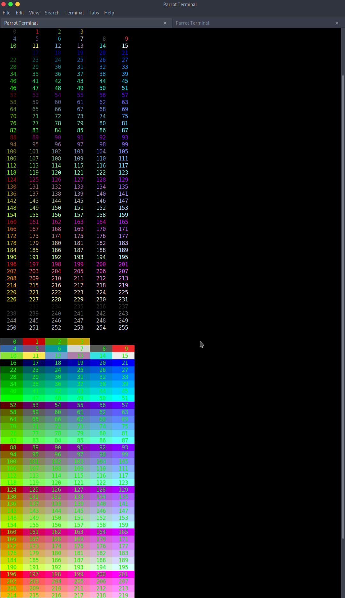

```
 ______ _______ _______ _______ _______ _____  
|      |   _   |_     _|_     _|    ___|     \ 
|   ---|       | |   |   |   | |    ___|  --  |
|______|___|___| |___|   |___| |_______|_____/ 
                                              
       _                        
       \`*-.                    
        )  _`-.                 
       .  : `. .                
       : _   '  \               
       ; *` _.   `*-._          
       `-.-'          `-.       
         ;       `       `.     
         :.       .        \    
         . \  .   :   .-'   .   
         '  `+.;  ;  '      :   
         :  '  |    ;       ;-. 
         ; '   : :`-:     _.`* ;
      .*' /  .*' ; .*`- +'  `*' 
      `*-*   `*-*  `*-*'
```

for the past week or so prior to releasing this i have been working on inteligence based code generators, and with my upcoming learning in c++ and C i have been wanting to build generators and translators for c, c++, go, ruby, and perl. Well today i made this code generator to generate hpp and h files or c++/C header files for ASCII color codes. Below is a screenshot of all generated colors and what they may output, the names in the definitions can not be changed as of now, however later on in this projects development it will be added to learn based on the output of the color or from a database.


]


#how to use 

this can be weird to use to im going to walk you through it, the generater uses a few color maps and charts in mind to generate the header files, and in order to do that it needed to generate random strings to assign a different name, you will need to look at the source code of the header file to determin the color that you want for example say i want a purple color that is 55 on the chart in the screenshot or the chart like this 

```
    0      1      2      3  
    4      5      6      7      8      9  
   10     11     12     13     14     15  
   16     17     18     19     20     21  
   22     23     24     25     26     27  
   28     29     30     31     32     33  
   34     35     36     37     38     39  
   40     41     42     43     44     45  
   46     47     48     49     50     51  
   52     53     54     55     56     57  
   58     59     60     61     62     63  
   64     65     66     67     68     69  
   70     71     72     73     74     75  
   76     77     78     79     80     81  
   82     83     84     85     86     87  
```

so we will look in the header files depending if we are using c or c++ and find the name with that code in it

`\e[38;5;55m`

is what we are looking for which in the .h file is `nbudcugg` later on when i have time i will make a better documentation for basic colors and have the generator make names for each color 

> EXAMPLE SCRIPTS 

`example_usage_c.c`


```c
#include <stdio.h>
#include "colors.h"

int main() {
    printf("Hello world %s this is a low purple color", nbudcugg);
}
```

include the header file with "" not <>, if the header file is in the local filepath where the script is then you do not need to specify a path but if it is not in the same file as some_file.c then you will need to use a path something `like path/to/header/file/colors.h`

`example_usage_cpp.cpp`


```cpp
#include "colors.hpp"
#include <stdlib.h>
#include <string>
#include <iostream>

using namespace std;


int main() {
   std::cout << meswkqhf << "Green blue" << std::endl;

}
```


`example usage ruby`

```rb
require_relative 'color.rb'

puts Colors::DNUJCFXC, "HEY GUYS!" # outputs deep purple color

```

# current language support from the generator

> C++

> C

> ruby
